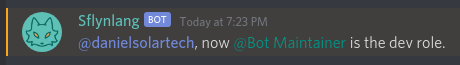
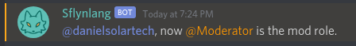
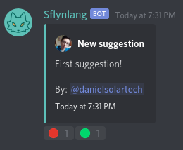

# Sflynlang Discord Bot


This repository contains source code for the official Discord bot of Sflynlang server.

## Pre-requisites

- [Node.JS](https://nodejs.org/)
- [Discord Bot Token](https://github.com/reactiflux/discord-irc/wiki/Creating-a-discord-bot-&-getting-a-token)
- [MongoDB](https://www.mongodb.com/)

## Built with

- [TypeScript](https://www.typescriptlang.org/)
- Decorators Pattern.
- Oriented Object Programming.

## How to Contribute

Please read the [contribution guidelines](./CONTRIBUTING.md) and [code of conduct](./CODE_OF_CONDUCT.md).

## Getting Started

1. Install the dependencies:

```bash
# With npm
$ npm install

# With yarn
$ yarn add
```

2. Build the project to production by running the following command:

```bash
# With npm
$ npm run start

# With yarn
$ yarn run start
```

3. Set the Discord bot token to the following environment file configuration:

```
DISCORD_TOKEN=Your token here
MONGODB=Your MongoDB connection url here
```

4. Initialize the bot in production: `npm run start` or `yarn run start`.

### Setting the dev role

```
!setrole dev @role-mention
```



### Setting the moderator role

```
!setrole mod @role-mention
```



### Setting the rules and welcomes channels

```
!setchannel rules #channel-mention
!setchannel welcomes #channel-mention
```


### Setting the suggestions channel

```
!setchannel suggestions #channel-mention
```


```
!suggestion First suggestion!
```



## Changelog

View the latest changes on [CHANGELOG.md](./CHANGELOG.md).

## Contributors

- **Daniel Solarte** - Initial Work - [GitHub](https://github.com/danielsolartech)

You can also view the [list of contributors](https://github.com/sflynlang/sflynlang-bot/contributors) here.

## Licensing

This project is under the MIT License. See the [LICENSE](./LICENSE) file for more information.
